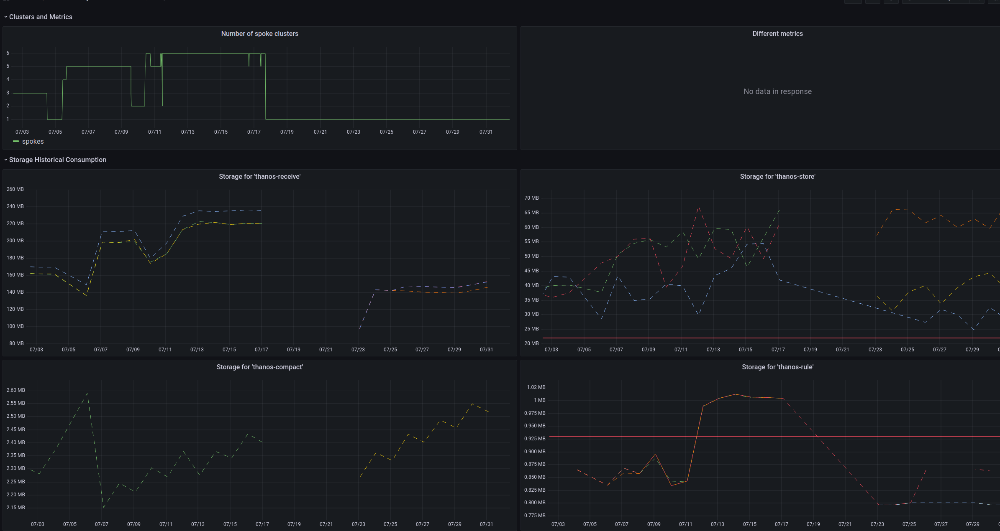

# observing-observability-dashboard
Just to draft a Grafana dashboard to observe RHACM Observability



it requires the following metrics available from the "local-cluster":

```yaml
apiVersion: v1
kind: ConfigMap
metadata:
  name: observability-metrics-custom-allowlist
  namespace: local-cluster
data:
  metrics_list.yaml: |
    names:
      - kubelet_volume_stats_used_bytes
      - kube_persistentvolumeclaim_info
      - kube_persistentvolumeclaim_status_phase
      - container_network_transmit_bytes_total
      - container_network_receive_bytes_total
      - prometheus_tsdb_storage_blocks_bytes
      - -kube_resourcequota
```
